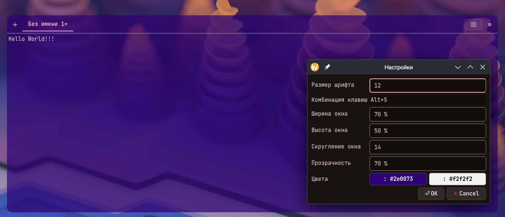

# kdropedit – Drop-Down Text Editor with Global Hotkeys

kdropedit provides a floating text editor window that can be summoned using a global keyboard shortcut (default: `Alt+S`). The window automatically hides when it loses focus, supports tabs, file opening/saving, appearance customization (font size, transparency, corner radius, colors), and is designed to work correctly in KDE Plasma / Wayland environments.

## Features

* **Global hotkey activation** – show/hide the editor window using a configurable keyboard shortcut (powered by `KF6GlobalAccel`).
* **Multi-window application mode** – the application remains running independently and does not quit when the last editor window is closed.
* **Tabbed interface** – create, close, reorder tabs, and access file actions through a context menu.
* **File management** – open text files in tabs, save files, and use **Save As**.
* **Adaptive positioning** – the window is centered on the active screen or the screen under the cursor; dimensions are specified as percentages of the available screen area.
* **Appearance customization**:

  * Font size
  * Window width and height (%)
  * Transparency
  * Corner radius
  * Background color
  * Text color
* **Borderless window dragging** – a dedicated DragHandle area allows moving the window without window decorations.
* **Persistent settings** – configuration is stored using `QSettings` under the `kdropedit` group.

## Dependencies

The project requires **Qt6** and **KDE Frameworks 6**. **Extra CMake Modules (ECM)** are also required for building.

| Component            | Purpose                                                                          |
| -------------------- | -------------------------------------------------------------------------------- |
| **Qt6::Core**        | Core functionality, `QSettings`, signals/slots, file handling                    |
| **Qt6::Gui**         | Colors, fonts, clipboard support, `QPaintEvent`, `QWindow`                       |
| **Qt6::Widgets**     | GUI widgets such as `QMainWindow`, `QPlainTextEdit`, `QTabBar`, `QStackedWidget` |
| **KF6::GlobalAccel** | Global keyboard shortcuts via `KGlobalAccel`                                     |
| **ECM**              | CMake modules required to locate and configure `KF6GlobalAccel`                  |

The project also uses standard C++17 headers (`algorithm`, `memory`, etc.), which are provided by the compiler toolchain.

## Build and Install

```bash
mkdir build
cd build
cmake .. -DCMAKE_BUILD_TYPE=Release
make -j$(nproc)
```

---

# kdropedit – выпадающий текстовый редактор с глобальными горячими клавишами

Приложение предоставляет текстовый редактор в виде плавающего окна, которое вызывается глобальной комбинацией клавиш (по умолчанию `Alt+S`). Окно автоматически скрывается при потере фокуса, поддерживает вкладки, открытие/сохранение файлов, настройку внешнего вида (размер шрифта, прозрачность, скругление углов, цвета) и корректно работает в окружении KDE Plasma / Wayland.

## Основной функционал

* **Глобальный вызов** – показ/скрытие окна по назначенной комбинации клавиш (используется `KF6GlobalAccel`).
* **Многооконный режим** – редактор работает как независимое приложение и не закрывается при последнем окне.
* **Вкладки** – создание, закрытие, перемещение, контекстное меню для сохранения и открытия файлов.
* **Работа с файлами** – открытие текстовых файлов во вкладке, сохранение и **Сохранить как**.
* **Адаптивное позиционирование** – окно центрируется относительно активного экрана или экрана под курсором, размеры задаются в процентах от доступной области.
* **Внешний вид**:

  * Размер шрифта
  * Ширина и высота окна (%)
  * Прозрачность
  * Радиус скругления углов
  * Цвет фона
  * Цвет текста
* **Перемещение окна** – специальная область-захват (DragHandle) для перетаскивания окна без рамок.
* **Сохранение настроек** – через `QSettings` (группа `kdropedit`).

## Требуемые библиотеки

Проект использует **Qt6** и **KDE Frameworks 6**. Для сборки также необходимы **Extra CMake Modules (ECM)**.

| Компонент            | Назначение                                                                |
| -------------------- | ------------------------------------------------------------------------- |
| **Qt6::Core**        | Базовая функциональность, `QSettings`, сигналы и слоты, работа с файлами  |
| **Qt6::Gui**         | Работа с цветами, шрифтами, буфером обмена, `QPaintEvent`, `QWindow`      |
| **Qt6::Widgets**     | Все виджеты: `QMainWindow`, `QPlainTextEdit`, `QTabBar`, `QStackedWidget` |
| **KF6::GlobalAccel** | Глобальные горячие клавиши через `KGlobalAccel`                           |
| **ECM**              | Модули CMake для поиска и настройки `KF6GlobalAccel`                      |

Также используются стандартные заголовки C++17 (`algorithm`, `memory` и другие), входящие в состав компилятора.

## Сборка и установка

```bash
mkdir build
cd build
cmake .. -DCMAKE_BUILD_TYPE=Release
make -j$(nproc)
```

